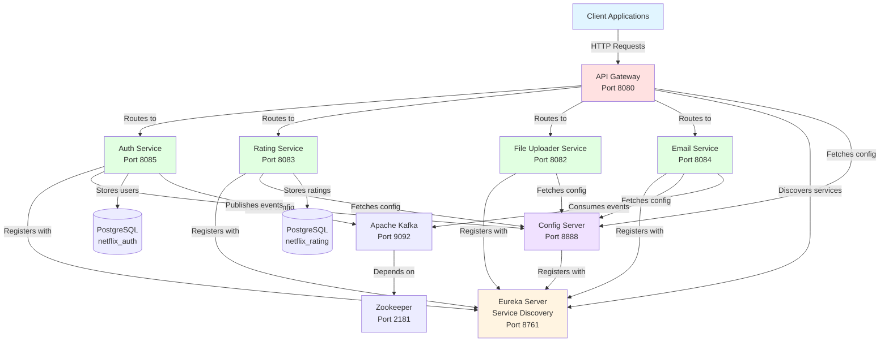

# Netflix Clone Microservices

A microservice-based Netflix clone built with Spring Boot and Spring Cloud, featuring service discovery, API gateway, authentication, file management, and rating services.

## System Architecture



## Services Overview

| Service                   | Port | Purpose                                       | Database                    |
| ------------------------- | ---- | --------------------------------------------- | --------------------------- |
| **Eureka Server**         | 8761 | Service discovery and registration            | None                        |
| **Config Server**         | 8888 | Centralized configuration management          | None                        |
| **API Gateway**           | 8080 | Single entry point, routing, load balancing   | None                        |
| **Auth Service**          | 8085 | Authentication, authorization, JWT management | PostgreSQL (netflix_auth)   |
| **Rating Service**        | 8083 | Video rating management                       | PostgreSQL (netflix_rating) |
| **File Uploader Service** | 8082 | File upload and storage                       | None                        |
| **Email Service**         | 8084 | Email notifications                           | None                        |

## Prerequisites

### Required Software

- **Java**: Version 17 or higher (Auth service uses Java 25)
- **Maven**: Version 3.6 or higher
- **PostgreSQL**: Version 12 or higher
- **Docker** (Optional): For running Kafka and Zookeeper

### Required Accounts

- **SMTP Account**: Gmail or other email provider for Email Service

## Initial Setup

### 1. Database Setup

Create the required PostgreSQL databases:

```sql
CREATE DATABASE netflix_auth;
CREATE DATABASE netflix_rating;
```

Update database credentials in configuration files if different from defaults:

- Default username: `postgres`
- Default password: `arpon007`
- Default host: `localhost:5432`

### 2. Kafka Setup (Optional - Not Yet Integrated)

> **Note**: Kafka infrastructure is provided via Docker Compose for future use, but it is **not currently integrated** into the services. The Auth Service has the Kafka dependency but no active configuration or usage. The Email Service does not have Kafka configured. This section documents how to set up Kafka for future integration.

Kafka can be used for asynchronous messaging between services (e.g., Auth Service publishing events, Email Service consuming them).

#### Option A: Using Docker Compose (Recommended)

**Step 1: Verify Docker Installation**

```bash
docker --version
docker-compose --version
```

If Docker is not installed, download from [https://www.docker.com/products/docker-desktop](https://www.docker.com/products/docker-desktop)

**Step 2: Start Kafka Services**

The project includes a `docker-compose.yml` file that sets up Kafka, Zookeeper, and Kafka UI:

```bash
# Navigate to project root
cd netflix-clone-microservice-spring-boot

# Start all Kafka services in detached mode
docker-compose up -d

# Verify services are running
docker-compose ps
```

**Step 3: Verify Kafka is Running**

```bash
# Check Kafka container logs
docker-compose logs kafka

# You should see: "Kafka Server started"
```

**Services Started:**

- **Zookeeper**: Port 2181 (Kafka coordination service)
- **Kafka Broker**: Port 9092 (Message broker)
- **Kafka UI**: Port 3000 (Web interface at `http://localhost:3000`)

**Step 4: Access Kafka UI**

Open your browser and navigate to `http://localhost:3000` to view:

- Topics
- Messages
- Consumer groups
- Broker information

**Step 5: Stop Kafka (when needed)**

```bash
# Stop all services
docker-compose down

# Stop and remove volumes (clean slate)
docker-compose down -v
```

#### Option B: Manual Kafka Installation (Alternative)

If you prefer not to use Docker:

**Step 1: Download Kafka**

Download Apache Kafka from [https://kafka.apache.org/downloads](https://kafka.apache.org/downloads)

**Step 2: Extract and Navigate**

```bash
tar -xzf kafka_2.13-3.5.0.tgz
cd kafka_2.13-3.5.0
```

**Step 3: Start Zookeeper**

```bash
# Windows
bin\windows\zookeeper-server-start.bat config\zookeeper.properties

# Linux/Mac
bin/zookeeper-server-start.sh config/zookeeper.properties
```

**Step 4: Start Kafka Broker (in new terminal)**

```bash
# Windows
bin\windows\kafka-server-start.bat config\server.properties

# Linux/Mac
bin/kafka-server-start.sh config/server.properties
```

#### Kafka Configuration in Services

The services are pre-configured to connect to Kafka at `localhost:9092`. No additional configuration needed if using default ports.

**Auth Service** (`auth/src/main/resources/application.yaml`):

```yaml
spring:
  kafka:
    bootstrap-servers: localhost:9092
    producer:
      key-serializer: org.apache.kafka.common.serialization.StringSerializer
      value-serializer: org.springframework.kafka.support.serializer.JsonSerializer
```

**Email Service** (`EmailService/src/main/resources/application.yaml`):

```yaml
spring:
  kafka:
    bootstrap-servers: localhost:9092
    consumer:
      group-id: email-service
      key-deserializer: org.apache.kafka.common.serialization.StringDeserializer
      value-deserializer: org.springframework.kafka.support.serializer.JsonDeserializer
```

#### Testing Kafka Integration

**Step 1: Start Kafka and Services**

Ensure Kafka is running, then start Auth Service and Email Service.

**Step 2: Trigger an Event**

Register a new user or request password reset:

```bash
curl -X POST http://localhost:8080/api/auth/forgot-password \
  -H "Content-Type: application/json" \
  -d '{"email": "test@example.com"}'
```

**Step 3: Verify in Kafka UI**

1. Open `http://localhost:3000`
2. Navigate to Topics
3. Look for topics like `user-events` or `email-notifications`
4. Check messages to see the published events

**Step 4: Check Email Service Logs**

The Email Service should log when it consumes messages from Kafka.

#### Troubleshooting Kafka

**Kafka won't start**

- Ensure ports 2181 and 9092 are not in use
- Check Docker has enough memory allocated (at least 4GB recommended)
- Verify `docker-compose.yml` is in the project root

**Services can't connect to Kafka**

- Verify Kafka is running: `docker-compose ps`
- Check Kafka logs: `docker-compose logs kafka`
- Ensure `bootstrap-servers` is set to `localhost:9092` in service configurations

**Messages not being consumed**

- Check consumer group is configured correctly
- Verify topic exists in Kafka UI
- Check Email Service is running and connected to Kafka
- Review Email Service logs for errors

### 3. Configuration Files

#### Auth Service Configuration

The Auth Service uses local configuration in `auth/src/main/resources/application.yaml`:

```yaml
spring:
  application:
    name: auth-service
  config:
    import: "optional:configserver:http://localhost:8888/"

app:
  cors:
    allowed-origins: "http://localhost:3000,http://localhost:5173,http://localhost:8080"
```

Update CORS origins based on your frontend application ports.

#### Config Server Repository

Configuration files are located in `configServer/src/main/resources/config-repo/`:

- `auth-service.yaml`: Auth service configuration
- `rating-service.yaml`: Rating service configuration
- `file-uploader-service.yaml`: File uploader configuration
- `email-service.yaml`: Email service configuration
- `api-gateway.yaml`: Gateway routing configuration

#### Email Service Configuration

Set environment variables before starting the Email Service:

```bash
export MAIL_USERNAME=your-email@gmail.com
export MAIL_PASSWORD=your-app-password
```

For Gmail, generate an App Password from your Google Account settings.

## Running the System

### Startup Order

Services must be started in the following order to ensure proper registration and configuration:

#### Step 1: Start Infrastructure Services

```bash
# Terminal 1 - Eureka Server
cd EurekaServer
mvn spring-boot:run
```

Wait for Eureka to start (check `http://localhost:8761`)

```bash
# Terminal 2 - Config Server (Optional)
cd configServer
mvn spring-boot:run
```

Wait for Config Server to start (check `http://localhost:8888/actuator/health`)

#### Step 2: Start API Gateway

```bash
# Terminal 3 - API Gateway
cd Gateway
mvn spring-boot:run
```

#### Step 3: Start Microservices

You can start these in any order, but all should be running:

```bash
# Terminal 4 - Auth Service
cd auth
mvn spring-boot:run
```

```bash
# Terminal 5 - Rating Service
cd RatingService
mvn spring-boot:run
```

```bash
# Terminal 6 - File Uploader Service
cd FIleUploderService
mvn spring-boot:run
```

```bash
# Terminal 7 - Email Service
cd EmailService
export MAIL_USERNAME=your-email@gmail.com
export MAIL_PASSWORD=your-app-password
mvn spring-boot:run
```

### Verification

1. **Eureka Dashboard**: Visit `http://localhost:8761` to verify all services are registered
2. **Config Server**: Visit `http://localhost:8888/auth-service/default` to verify configuration
3. **API Gateway**: Test `http://localhost:8080/api/auth/health` to verify routing

## API Endpoints

All APIs are accessible through the API Gateway at `http://localhost:8080`.

### Authentication Service

| Method | Endpoint                    | Description               | Auth Required |
| ------ | --------------------------- | ------------------------- | ------------- |
| POST   | `/api/auth/register`        | Register new user         | No            |
| POST   | `/api/auth/login`           | Login and get JWT token   | No            |
| POST   | `/api/auth/forgot-password` | Request password reset    | No            |
| POST   | `/api/auth/reset-password`  | Reset password with token | No            |
| POST   | `/api/auth/change-password` | Change password           | Yes           |
| GET    | `/api/auth/health`          | Health check              | No            |

### Rating Service

| Method | Endpoint                       | Description                 | Auth Required |
| ------ | ------------------------------ | --------------------------- | ------------- |
| POST   | `/api/ratings`                 | Submit video rating         | Yes           |
| GET    | `/api/ratings/video/{videoId}` | Get video rating statistics | No            |

### File Uploader Service

| Method | Endpoint                      | Description    | Auth Required |
| ------ | ----------------------------- | -------------- | ------------- |
| POST   | `/api/files/upload`           | Upload file    | Yes (Admin)   |
| GET    | `/api/files/image/{filename}` | Get image file | No            |
| GET    | `/api/files/video/{filename}` | Get video file | No            |

### Email Service

| Method | Endpoint          | Description | Auth Required |
| ------ | ----------------- | ----------- | ------------- |
| POST   | `/api/email/send` | Send email  | Yes           |

## Testing

### Postman Collection

Import the provided Postman collection for testing:

```bash
NetflixClone.postman_collection.json
```

The collection includes:

- Authentication flows
- Rating operations
- File upload examples
- Email sending examples
- Config Server verification

### Manual Testing

1. **Register a user**:

```bash
curl -X POST http://localhost:8080/api/auth/register \
  -H "Content-Type: application/json" \
  -d '{
    "email": "test@example.com",
    "fullName": "Test User",
    "password": "password123"
  }'
```

2. **Login**:

```bash
curl -X POST http://localhost:8080/api/auth/login \
  -H "Content-Type: application/json" \
  -d '{
    "email": "test@example.com",
    "password": "password123"
  }'
```

3. **Rate a video** (use token from login):

```bash
curl -X POST http://localhost:8080/api/ratings \
  -H "Content-Type: application/json" \
  -H "Authorization: Bearer YOUR_JWT_TOKEN" \
  -d '{
    "videoId": 101,
    "rating": 4.5
  }'
```

## Troubleshooting

### Common Issues

**Service not registering with Eureka**

- Ensure Eureka Server is running first
- Check network connectivity to `localhost:8761`
- Verify `eureka.client.service-url.defaultZone` in configuration

**Config Server connection failed**

- Services use `optional:configserver:` prefix, so they will start without Config Server
- Local `application.yaml` takes precedence over Config Server
- Restart Config Server after configuration changes

**Database connection errors**

- Verify PostgreSQL is running
- Check database credentials in configuration files
- Ensure databases `netflix_auth` and `netflix_rating` exist

**Port already in use**

- Check if another service is using the port: `netstat -ano | findstr :PORT`
- Kill the process or change the port in configuration

**CORS errors**

- Update `app.cors.allowed-origins` in `auth/src/main/resources/application.yaml`
- Add your frontend URL to the allowed origins list

## Development Notes

### Adding New Services

1. Create new Spring Boot project
2. Add Eureka Client dependency
3. Configure `spring.application.name` and Eureka client settings
4. Register routes in `api-gateway.yaml`
5. Add configuration file to Config Server repository

### Configuration Priority

Configuration is loaded in the following order (later overrides earlier):

1. Config Server (if available)
2. Local `application.yaml`
3. Environment variables
4. Command-line arguments

## License

This project is for educational purposes.
